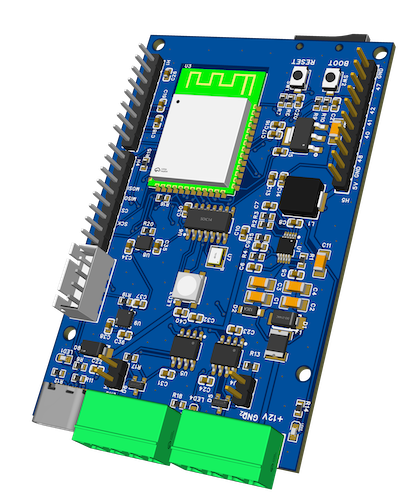

# ESP32-S3 Dual CAN-FD Development Board



An ESP32-S3-based development board featuring dual CAN bus interfaces (TWAI + SPI MCP2517FD), a 6-axis IMU, magnetometer compass, GPS receiver, multi-screen OLED display, SD card logging, and an addressable RGB status LED.

## Features

- **Dual CAN Bus** — Built-in ESP32 TWAI (CAN 2.0) + external MCP2517FD (CAN-FD) via SPI
- **IMU** — BMI270 6-axis accelerometer/gyroscope (I2C) with motion-reactive LED feedback
- **Magnetometer** — MMC5983MA digital compass (I2C) with MotionCal calibration support
- **GPS** — u-blox NEO-6M (UART1, TXD0/RXD0) with TinyGPSPlus parsing; fix, speed, altitude, course, satellite count
- **OLED Display** — SSD1306 128×64 (I2C) with three cycled screens: Compass, GPS, Accelerometer
- **SD Card Logging** — Logs accelerometer, magnetometer, and GPS data to CSV on a microSD card (SPI)
- **RGB Status LED** — WS2812 NeoPixel on GPIO 21 with 10 animated patterns and motion-driven color modes
- **Demo TX Mode** — GPIO-gated CAN transmit for testing both buses independently

## Hardware

- **MCU:** ESP32-S3-DevKitM-1
- **CAN-FD Controller:** MCP2517FD (SPI)
- **IMU:** BMI270 + BMM150 (I2C)
- **Magnetometer:** MMC5983MA (I2C, address 0x30)
- **GPS:** u-blox NEO-6M (UART1)
- **Display:** SSD1306 OLED 128×64 (I2C, address 0x3C)
- **LED:** WS2812 NeoPixel (1 pixel)

## Pin Assignments

### I2C Bus (Wire — default ESP32-S3 pins)

| Function | Pin |
|---|---|
| SDA | Default ESP32-S3 I2C SDA |
| SCL | Default ESP32-S3 I2C SCL |

Devices on I2C: BMI270 IMU, MMC5983MA magnetometer (0x30), SSD1306 OLED (0x3C)

### SPI Bus (FSPI)

| Function | GPIO |
|---|---|
| SCK | 14 |
| MISO | 10 |
| MOSI | 11 |
| CAN CS | 13 |
| CAN INT | 12 |
| SD CS | 47 |

### CAN Bus — TWAI (built-in)

| Function | GPIO |
|---|---|
| TWAI TX | 18 |
| TWAI RX | 17 |

Default bitrate: 500 kbps

### CAN Bus — SPI MCP2517FD

| Function | GPIO |
|---|---|
| CS | 13 |
| INT | 12 |
| SCK | 14 |
| MISO | 10 |
| MOSI | 11 |

Default bitrate: 500 kbps (CAN 2.0B mode)

### GPS — NEO-6M (UART1)

| Function | GPIO | NEO-6M pin |
|---|---|---|
| TX (ESP → GPS) | 43 (TXD0) | RX |
| RX (GPS → ESP) | 44 (RXD0) | TX |
| Power | 3.3 V | VCC |
| Ground | GND | GND |

Baud rate: 9600. Serial uses `Serial1`; `Serial` (USB-CDC) is unaffected.

### Status / Indicator LEDs

| Function | GPIO |
|---|---|
| NeoPixel RGB LED | 21 |
| TWAI TX/RX Activity LED | 38 |
| SPI CAN TX/RX Activity LED | 39 |

### Control Inputs (active LOW, INPUT_PULLUP)

| Function | GPIO | Description |
|---|---|---|
| TWAI Demo TX Enable | 4 | Ground to enable periodic TWAI demo transmissions (ID 0x321) |
| SPI Demo TX Enable | 5 | Ground to enable periodic SPI CAN demo transmissions (ID 0x322) |
| BMI270 Enable | 6 | Ground to enable IMU polling and motion-reactive LED |
| MMC5983MA Enable | 15 | Ground to enable magnetometer polling |
| Calibration Mode | 16 | Ground to enter MotionCal calibration stream mode |
| OLED Screen Cycle | 40 | Ground momentarily to cycle OLED screen (Compass → GPS → Accel) |

## Building & Flashing

Requires [PlatformIO](https://platformio.org/).

```bash
cd firmware/demo
pio run                              # build
pio run --target upload              # flash via USB
pio device monitor                   # serial monitor @ 115200 baud
```

## Serial Commands / Runtime Behavior

On boot, the firmware prints the GPIO state and starts all peripherals. Control behavior by grounding the input pins:

- **GPIO 4 LOW** — Transmit TWAI demo frames (ID 0x321) every 500 ms
- **GPIO 5 LOW** — Transmit SPI CAN demo frames (ID 0x322) every 500 ms
- **GPIO 6 LOW** — Enable BMI270 accelerometer; LED color reflects tilt and motion
- **GPIO 16 LOW** — Enter MotionCal calibration mode (streams `Raw:` data at 100 Hz for PJRC MotionCal)
- **GPIO 40 LOW** — Cycle OLED screen: Compass [1/3] → GPS [2/3] → Accel [3/3]

The MMC5983MA magnetometer, OLED display, and GPS receiver are always active (auto-reinit on failure).

### GPS Startup Diagnostics

On first boot the firmware prints every raw NMEA sentence for 10 seconds:
```
[GPS RAW] $GPGGA,...
[GPS RAW] $GPRMC,...
```
After 10 seconds it reports a summary. If `0 chars in 10s` is printed, check wiring (GPS TX → GPIO 44, GPS RX → GPIO 43, 3.3 V, GND). A "no fix" is normal indoors — the module typically acquires a fix within 30–90 seconds with a clear sky view.

## OLED Screens

The display cycles through three screens, selected by grounding GPIO 40:

| Screen | Content |
|---|---|
| **COMPASS [1/3]** | Heading in degrees + cardinal direction (N/NE/E/…) |
| **GPS [2/3]** | Lat/lon, altitude, speed, course, satellite count (or no-fix diagnostics) |
| **ACCEL [3/3]** | X/Y/Z acceleration and magnitude in g (shows "OFFLINE" if GPIO 6 is not grounded) |

Each screen refreshes every 200 ms automatically.

## SD Card Logging

When a microSD card is present (CS on GPIO 47, sharing the FSPI bus), sensor data is logged to `/LOGnnn.CSV` with columns:

```
time_ms,type,f1,f2,f3,f4
```

| Type | f1 | f2 | f3 | f4 |
|---|---|---|---|---|
| `ACCEL` | ax (g) | ay (g) | az (g) | magnitude (g) |
| `MAG` | heading (deg) | rawX | rawY | rawZ |
| `GPS` | latitude | longitude | altitude (m) | speed (kph) |

## Dependencies

Managed by PlatformIO (`lib_deps` in `platformio.ini`):

| Library | Version |
|---|---|
| ArduinoJson | ^6.21.5 |
| acan2517FD | ^2.1.16 |
| ESP32-TWAI-CAN | ^1.0.1 |
| Adafruit NeoPixel | ^1.12.5 |
| Arduino_BMI270_BMM150 | ^1.2.3 |
| SparkFun MMC5983MA | ^1.0.5 |
| Adafruit SSD1306 | ^2.5.9 |
| TinyGPSPlus | ^1.0.3 |

## License

See repository root for license details.
